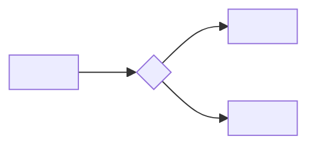

# Molde da validação por especialista

O dossiê que a sessão monta quando a dúvida é de domínio e nenhum instrumento
responde. O corpo da skill diz quando abrir este arquivo.

Quem lê é gente do negócio, não de código: o dossiê mostra o que o sistema faz
hoje, prova cada afirmação com o trecho que a sustenta, e pede **uma escolha**
por card — nunca uma redação. O que volta vira pedido técnico pelo prompt do
fim.

## 1. O diagrama do fluxo de dados

Abre o dossiê. Onde o dado entra, o que decide sobre ele, onde ele para. Só as
caixas que a dúvida toca — diagrama do sistema inteiro ninguém lê:

````markdown

````

Nomes de negócio nas caixas, nunca nomes de arquivo ou de função: quem valida
não conhece a árvore do repositório.

## 2. A afirmação e o trecho que a sustenta

Uma afirmação por vez, e **nenhuma sem o trecho ao lado**. Afirmação sem
código é memória de quem leu, e é justamente onde o erro se esconde:

````markdown
**Afirmação:** <o que o sistema faz hoje, em uma frase de negócio>

`<caminho>:<linha>`

```<linguagem>
<3 a 10 linhas: as que decidem, não a função inteira>
```
````

O trecho se cola do arquivo, nunca se redige de memória — é a regra 2.

## 3. A tabela numérica

O número que mostra o tamanho da decisão. Cada linha traz o comando que a
mediu, para o especialista saber que não é estimativa:

```markdown
| <o caso> | <quantos> | <o que muda se a regra mudar> |
| -------- | -------- | ----------------------------- |
| <...>    | <...>    | <...>                         |

Medido por: `<o comando exato>`
```

Sem número, a pergunta vira gosto: "isto está certo?" pesa diferente de "isto
está certo para `<N>` casos por mês?".

## 4. O veredito por card

Uma dúvida por card. Card que pergunta duas coisas se parte em dois — resposta
misturada não se aproveita:

```markdown
### Card <n> — <a dúvida em uma linha>

Contexto: <duas linhas, no vocabulário do negócio>
O que o sistema faz hoje: <a afirmação da seção 2, por número>
Quantos casos: <o número da seção 3>

Veredito — marque um:
- [ ] Está certo, segue assim
- [ ] Está errado; o certo é: ____________
- [ ] Depende de: ____________

Comentário (opcional): ____________
```

A terceira caixa é a que mais rende: "depende" não é resposta incompleta, é a
descoberta de que a pergunta estava mal feita.

## 5. O prompt que transforma as respostas em pedido técnico

Cole isto numa sessão nova, junto com o dossiê respondido:

```markdown
Você recebeu o dossiê de validação <assunto>, já respondido pelo especialista.
Para cada card, na ordem:

1. Cite o número do card e o veredito marcado, verbatim.
2. "Está errado" vira mudança: diga o arquivo e a função pelo nome, e escreva
   o critério de aceitação verificável por comando.
3. "Está certo" vira teste de regressão do comportamento de hoje, nunca
   mudança.
4. "Depende" NÃO vira pedido: volta como card novo para o especialista, com o
   que ficou por decidir.

A saída é o corpo de uma issue, no molde de `moldes.md`. O que o especialista
não respondeu fica em "Fora" do escopo — não se preenche por dedução.
```

## As três recusas do dossiê

Não mande o dossiê ao especialista quando faltar qualquer uma:

- **Afirmação sem trecho de código.** É opinião pedindo carimbo.
- **Card sem número medido.** Sem tamanho, ninguém sabe o que está decidindo.
- **Card com duas perguntas dentro.** A resposta volta ambígua e a sessão
  seguinte chuta qual metade valia.
